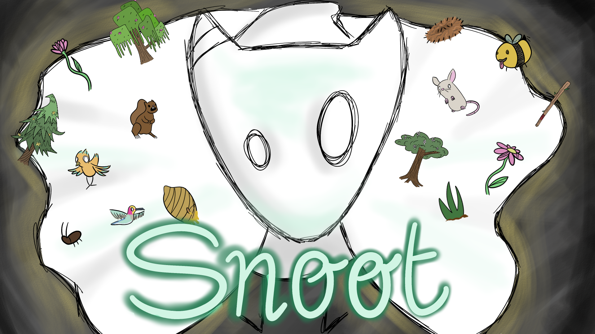
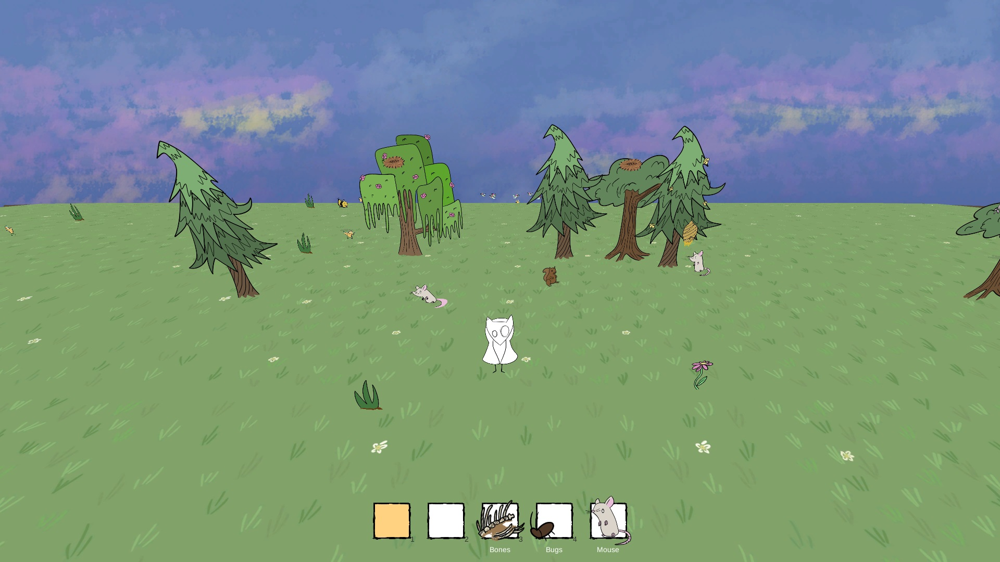

<h1>

Snoot
</h1>

 \
 

Restore life to a desolate world.

**Global Game Jam 2020**\
**Theme**: "Repair"

## Credits

**[Timothy Sanderson](https://github.com/40219124):** Programmer\
**[Fydar](https://github.com/Fydar):** Programmer\
**[Emma Parsley](https://github.com/40206111):** Artist
